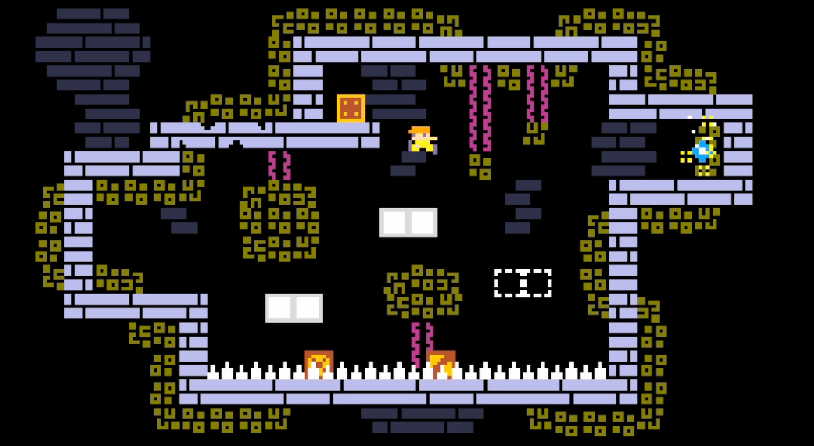
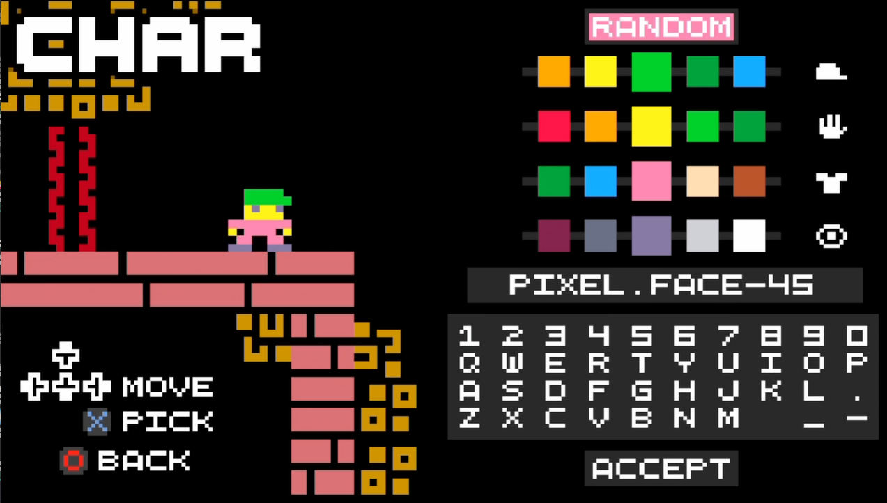

# Tiny-Crate-Vita
Tiny Crate Vita is a port of the original game made by HarmonyHoney

#  Tiny Crate
Made with Godot 3.6

Precision Puzzle Platformer Game

Play now at [harmonyhoney.itch.io/tinycrate](https://harmonyhoney.itch.io/tinycrate) ! (:

## License
This is free and unencumbered software!
the original source code is here: [source](https://github.com/HarmonyHoney/tiny_crate/tree/master2)

## Screenshots
# 
# 
# 
